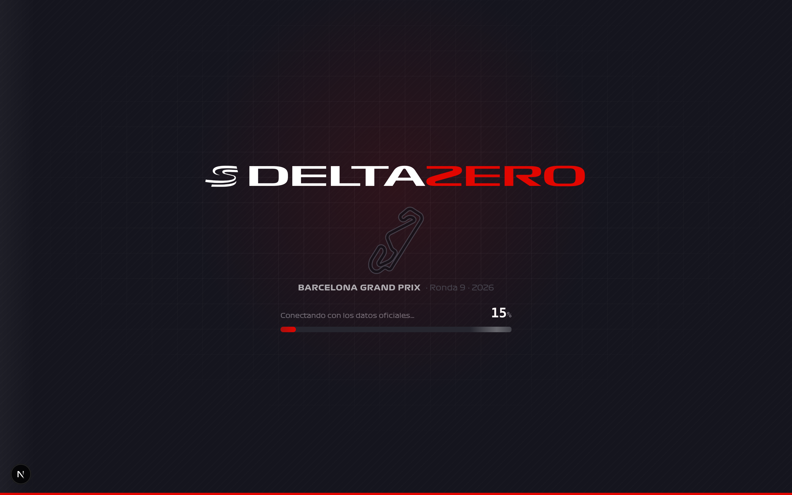
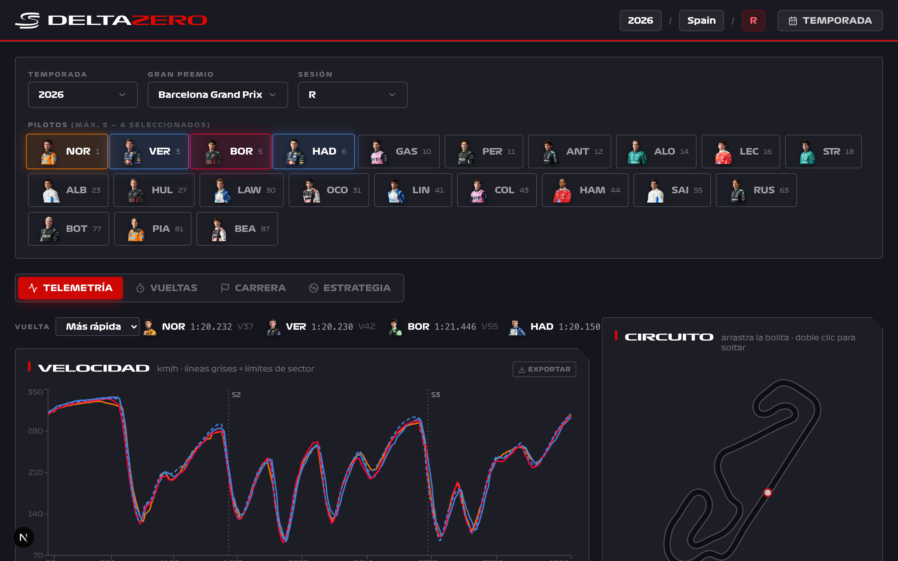
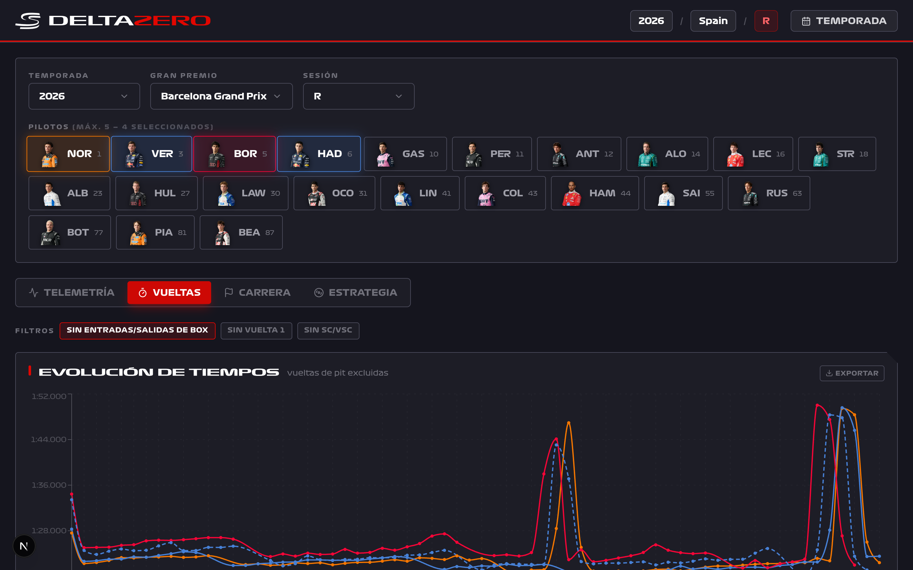
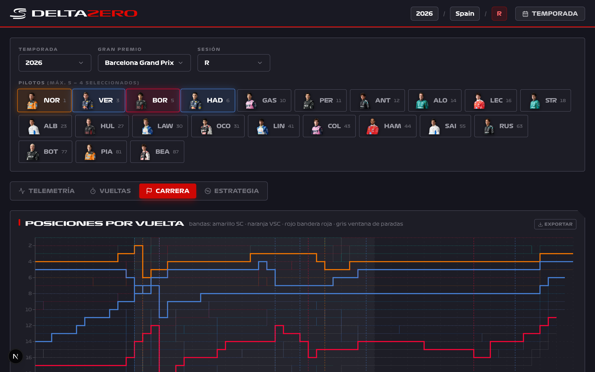
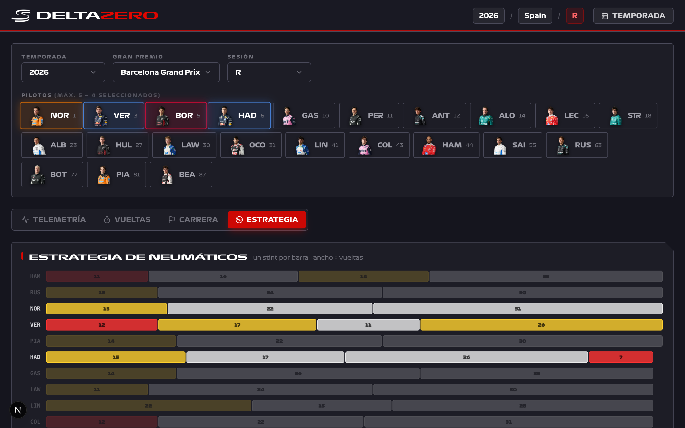
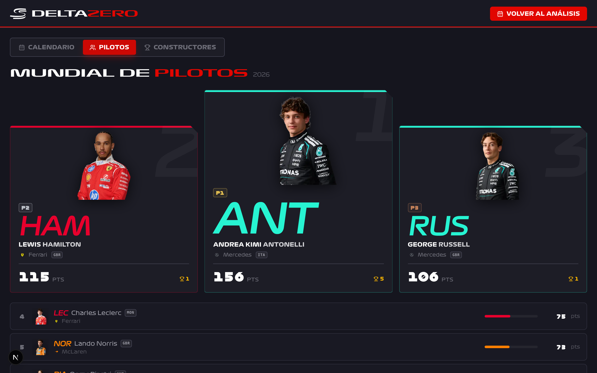
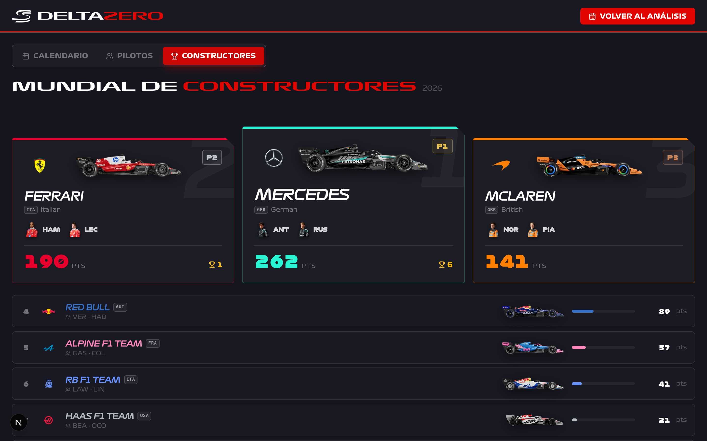
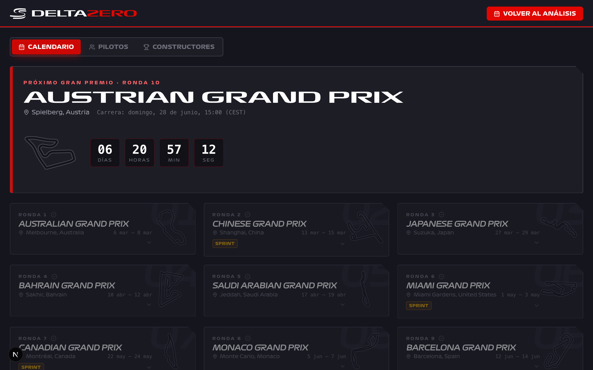
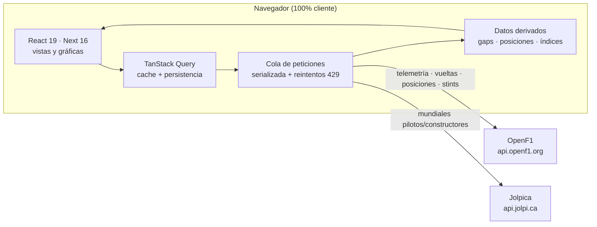

<div align="center">



# DeltaZero

**Panel de análisis de Fórmula 1 con telemetría real — 100 % frontend, sin servidor propio.**

Compara hasta 5 pilotos vuelta a vuelta sobre un mapa interactivo del circuito, estudia el ritmo de carrera, la estrategia de neumáticos y los mundiales. Todo se calcula en el navegador a partir de las APIs públicas de [OpenF1](https://openf1.org) y [Jolpica](https://github.com/jolpica/jolpica-f1).

<br/>

[](https://nextjs.org)
[](https://react.dev)
[](https://www.typescriptlang.org)
[](https://tailwindcss.com)

[](https://recharts.org)
[](https://gsap.com)
[](https://tanstack.com/query)
[](https://zustand-demo.pmnd.rs)
[](#arquitectura)

**[Ver demo en vivo](https://delta-zero.vercel.app)**

</div>

---

## Índice

- [Vistazo rápido](#vistazo-rápido)
- [Características](#características)
  - [Telemetría comparativa](#telemetría-comparativa)
  - [Análisis de ritmo](#análisis-de-ritmo)
  - [Carrera](#carrera)
  - [Estrategia de neumáticos](#estrategia-de-neumáticos)
  - [Mundiales](#mundiales)
  - [Calendario](#calendario)
- [Arquitectura](#arquitectura)
- [Stack](#stack)
- [Puesta en marcha](#puesta-en-marcha)
- [Scripts](#scripts)
- [Estructura del proyecto](#estructura-del-proyecto)
- [Despliegue](#despliegue)
- [Limitaciones](#limitaciones)
- [Fuentes de datos y créditos](#fuentes-de-datos-y-créditos)

---

## Vistazo rápido

DeltaZero recrea la experiencia del muro de boxes en una sola página: eliges **temporada → Gran Premio → sesión**, seleccionas hasta cinco pilotos y exploras sus datos cruzados en cuatro vistas más los mundiales y el calendario. Todos los paneles se exportan a **PNG o CSV**.

| | |
|---|---|
| **Datos reales** | Calendario, pilotos, vueltas, telemetría, posiciones, stints y resultados oficiales desde 2023 |
| **Hasta 5 pilotos** | Comparativa simultánea en todas las vistas, con el color de cada equipo |
| **Sin backend** | El navegador habla directamente con las APIs públicas; cero coste de infraestructura |
| **Datos derivados** | Gaps y posiciones por vuelta se calculan en el cliente cruzando los tiempos de los 20 coches |
| **Exportable** | Cada gráfica y tabla se descarga en PNG o CSV |

---

## Características

### Telemetría comparativa

Velocidad, RPM, acelerador, freno, marcha y **delta entre pilotos** trazados por distancia, en la vuelta rápida o en cualquier vuelta concreta. Los tiempos por sector (S1/S2/S3) se proyectan sobre las gráficas.

El **mapa del circuito** está sincronizado con las gráficas en ambos sentidos: arrastra el marcador por el trazado —o pasa el ratón por las curvas— y verás la posición, velocidad, marcha y DRS de cada piloto en ese punto. Pulsa *play* y la vuelta se reproduce como un coche fantasma.

<div align="center">
  
</div>

### Análisis de ritmo

Evolución de los tiempos de vuelta, scatter por compuesto y mapa de calor de degradación de neumáticos. Filtros para excluir **entradas/salidas de boxes**, la **vuelta 1** y los periodos de **Safety Car / VSC**, de modo que la comparación quede limpia.

<div align="center">
  
</div>

### Carrera

Posiciones vuelta a vuelta y **gap al líder**, con bandas para Safety Car (amarillo), VSC (naranja) y bandera roja (rojo), más la ventana de paradas. Los pilotos seleccionados se destacan sobre el resto de la parrilla.

<div align="center">
  
</div>

### Estrategia de neumáticos

Timeline de **stints por compuesto** para toda la parrilla: una barra por stint, ancho proporcional a las vueltas. De un vistazo se ve quién montó qué y cuándo paró.

<div align="center">
  
</div>

### Mundiales

Clasificación de **pilotos y constructores** con podio destacado, fotos, colores de equipo y puntos. Datos servidos por Jolpica.

<table>
  <tr>
    <td width="50%"></td>
    <td width="50%"></td>
  </tr>
</table>

### Calendario

Todo el calendario de la temporada con cuenta atrás al **próximo Gran Premio**, mini-trazado de cada circuito, marcado de fines de semana **Sprint** y horarios ajustados a la **zona horaria del usuario**.

<div align="center">
  
</div>

---

## Arquitectura

DeltaZero no tiene servidor de aplicación: es un cliente estático que llama directamente a dos APIs públicas y deriva en el navegador lo que las APIs no ofrecen.



Detalles que hacen que esto funcione sin backend:

- **Cola de peticiones** serializada con reintentos y *jitter* ante el `429` de OpenF1 (`lib/openf1.ts`), respetando su rate limit.
- **Carga en paralelo y tolerante a fallos**: la telemetría se pide por piloto concurrentemente; si uno no tiene datos, el resto sigue.
- **Datos derivados en el cliente**: los gaps y las posiciones por vuelta no existen en la API — se calculan cruzando los tiempos de vuelta de los 20 pilotos.
- **Persistencia selectiva**: calendario y mundiales se cachean en local para no volver a pedirlos.

---

## Stack

| Capa | Tecnología |
|------|-----------|
| Framework | **Next.js 16** (App Router, Turbopack) · **React 19** |
| Lenguaje | **TypeScript 5** |
| Estilos | **Tailwind CSS v4** |
| Gráficas | **Recharts 3** |
| Animación | **GSAP 3** · **Framer Motion 12** |
| Estado servidor | **TanStack Query 5** (cache + persistencia local) |
| Estado UI | **Zustand 5** |
| Iconos | **lucide-react** |

> Tooling de calidad: **ESLint 9** + **Prettier 3** con scripts `lint` / `format` / `type-check` (0 errores).

---

## Puesta en marcha

**Requisitos:** Node.js 20 o superior.

```bash
# 1. Instalar dependencias
npm install

# 2. Arrancar en desarrollo
npm run dev
```

Abre la URL que imprime el comando (por defecto `http://localhost:3000`), elige **temporada → GP → sesión** y selecciona hasta 5 pilotos.

No hace falta ninguna variable de entorno: la app funciona contra las APIs públicas tal cual.

---

## Scripts

| Comando | Acción |
|---------|--------|
| `npm run dev` | Servidor de desarrollo (Turbopack) |
| `npm run build` | Build de producción |
| `npm run start` | Sirve el build de producción |
| `npm run lint` | ESLint sobre todo el proyecto |
| `npm run format` | Formatea con Prettier |
| `npm run format:check` | Comprueba el formato sin escribir |
| `npm run type-check` | Comprobación de tipos (`tsc --noEmit`) |

---

## Estructura del proyecto

```
app/            App Router: layout, página principal, metadata, SEO (robots, sitemap, OG)
components/     Vistas y UI
  telemetry/    Telemetría: gráficas, mapa del circuito, playback (LapPicker, useMergedTelemetry, usePlayback)
  laps/         Evolución de tiempos y degradación
  race/         Posiciones y gaps
  strategy/     Timeline de stints
  championship/ Mundiales de pilotos y constructores
  calendar/     Calendario, mini-trazados y resultados de sesión
hooks/          useF1Data (queries), useTimeZone
lib/            Cliente de datos (openf1.ts), API (api.ts), tipos, utilidades, export PNG/CSV
store/          Estado de sesión (Zustand)
public/         Coches, pilotos y logos de equipos
```

---

## Despliegue

Al ser **solo frontend**, se despliega en Vercel sin servidor ni coste:

1. Sube el repo a GitHub.
2. En [vercel.com](https://vercel.com) → **New Project** → importa el repo.
3. Deploy. **No necesita variables de entorno.**

Más detalles en [DEPLOY.md](DEPLOY.md).

---

## Limitaciones

- **Datos desde 2023**: OpenF1 no cubre temporadas anteriores; cualquier comparativa histórica topa ahí.
- **Telemetría a ~3.7 Hz**: la primera carga de una sesión tarda unos segundos por el rate limit de OpenF1.
- **Sin números de curva** en el mapa (OpenF1 no expone *corners*; el trazado se dibuja igual desde la telemetría).
- Sesiones muy recientes pueden no tener datos de posición todavía: el mapa muestra un aviso y el resto de la app sigue funcionando.

---

## Fuentes de datos y créditos

- **[OpenF1](https://openf1.org)** (`api.openf1.org`) — calendario, pilotos, vueltas, telemetría, posiciones, stints y resultados.
- **[Jolpica](https://github.com/jolpica/jolpica-f1)** (`api.jolpi.ca`) — mundiales de pilotos y constructores.

**Tipografía:** la familia **F1 Display** (© Marc Rouault / W+K para Formula 1), servida en local desde `app/fonts/`, distribuida por terceros como *free for personal use*. Válida para este proyecto personal, **no apta para uso comercial**. Fallback: Titillium Web (Google Fonts).

> Proyecto personal sin ánimo de lucro y sin relación oficial con la Fórmula 1, la FIA ni los equipos. Todas las marcas pertenecen a sus respectivos propietarios.

---

<div align="center">
  <sub>Hecho con datos abiertos y bastante pasión por la F1.</sub>
</div>
